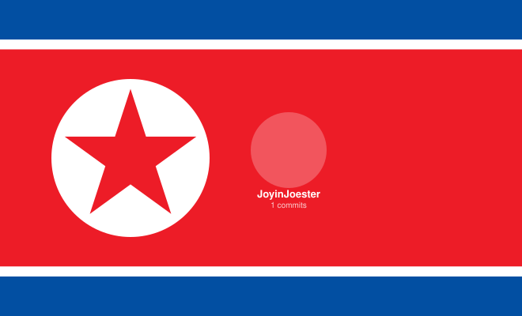

# North Korea Contributor Flag

[English](README.md) | [中文](README.zh-CN.md) | [한국어](README.ko.md)

A GitHub Action that generates a configurable North Korea flag SVG with your project's top contributors displayed on the flag.



---

## What This Does

This action automatically generates an SVG image that looks like the North Korea national flag, with two customizations:

1. **Replace the star** with your project's logo/icon (or keep the default red star)
2. **Display top contributors** (by commit count) on the red stripe with customizable avatar shapes

The SVG updates automatically every week, so the contributor list stays current.

### Visual Layout

```
┌──────────────────────────────────────────────────┐
│  ┌─── blue stripe ────┐                          │
│  │                    │                          │
│  ├─── white stripe ───┤                          │
│  │                    │                          │
│  │    ┌──────────┐    │    ┌───┐  ┌───┐  ┌───┐  │
│  │    │          │    │    │   │  │   │  │   │  │
│  │    │  icon/   │    │    │ 👤│  │ 👤│  │ 👤│  │
│  │    │  star    │    │    │   │  │   │  │   │  │
│  │    │          │    │    └───┘  └───┘  └───┘  │
│  │    └──────────┘    │    user1  user2  user3   │
│  │       white disc   │    372     49     13     │
│  │                    │    commits               │
│  ├─── white stripe ───┤                          │
│  │                    │                          │
│  └─── blue stripe ────┘                          │
│                                                  │
│         ← flag (660×400px) →                     │
└──────────────────────────────────────────────────┘
```

- **Left side**: White disc with your icon (or a red star by default)
- **Right side**: Top contributors' avatars with their username and commit count

---

## Web Configurator

Don't want to configure GitHub Actions? Use the **[online generator](https://joyinjoester.github.io/North-Korea-Flag/)** to visually configure and preview your flag, then download as SVG or PNG.

Features:
- Live preview with instant updates
- Color pickers for all stripe colors
- Custom icon upload with scale control
- Multiple avatar shapes: circle, square, passport (3:4), portrait (2:3), and more
- Option to hide contributor text
- Fetch contributors directly from any public GitHub repository
- Export as SVG or high-resolution PNG

---

## Quick Start (3 Steps)

### Step 1: Create the workflow file

In your GitHub repository, create a file at `.github/workflows/contributors.yml`:

```yaml
name: Update Contributor Flag
on:
  workflow_dispatch:        # allows manual trigger
  schedule:
    - cron: '17 3 * * 1'   # runs every Monday at 03:17 UTC

permissions:
  contents: write           # needed to commit the SVG file

jobs:
  update:
    runs-on: ubuntu-latest
    steps:
      - uses: actions/checkout@v6

      - uses: JoyinJoester/North-Korea-Flag@main
        with:
          repo: 'your-username/your-repo'   # ← change this to your repo
```

> **Tip**: Replace `your-username/your-repo` with your actual GitHub repository, e.g. `octocat/Hello-World`.

### Step 2: Run the workflow

Go to your repo → **Actions** tab → click **Update Contributor Flag** → **Run workflow**.

Wait about 30 seconds for it to complete. It will create a `output.svg` file in your repo.

### Step 3: Add to your README

In your `README.md`, add this line where you want the flag to appear:

```markdown

```

That's it! The flag will update automatically every week.

---

## Configuration

### Minimal (just the repo)

```yaml
- uses: JoyinJoester/North-Korea-Flag@main
  with:
    repo: 'owner/repo'
```

This uses the default North Korea flag colors (blue/red/white) with a red star.

### Custom colors

Change the flag stripe colors to match your project's theme:

```yaml
- uses: JoyinJoester/North-Korea-Flag@main
  with:
    repo: 'owner/repo'
    blue: '#1a365d'     # dark navy blue
    red: '#c53030'      # dark red
    white: '#ffffff'    # white
```

Color values are in hex format (e.g. `#FF0000` for red). Use any online color picker to find the right values.

### Custom icon (replacing the star)

Replace the red star with your project's logo:

```yaml
- uses: JoyinJoester/North-Korea-Flag@main
  with:
    repo: 'owner/repo'
    icon-url: 'https://raw.githubusercontent.com/owner/repo/main/icon.png'
```

**Icon notes**:
- Must be a publicly accessible image URL
- Any shape is auto-clipped into a circle
- Square images work best (e.g. 256×256 or 512×512)
- Scale defaults to 0.8 (80% of disc). Set `icon-scale: '1.0'` to fill the entire disc

### Avatar shapes

By default, contributor avatars are displayed as circles. You can change the shape:

```yaml
- uses: JoyinJoester/North-Korea-Flag@main
  with:
    repo: 'owner/repo'
    shape: '3:4'    # passport photo ratio
```

Available shapes:

| Shape | Description |
|-------|-------------|
| `circle` | Default circular avatars |
| `roundrect` | Rounded rectangle (square ratio) |
| `1:1` | Square |
| `3:4` | Passport photo ratio |
| `2:3` | Portrait ratio |
| `4:5` | Photo ratio |

### Hide contributor text

Show only avatars without names or commit counts:

```yaml
- uses: JoyinJoester/North-Korea-Flag@main
  with:
    repo: 'owner/repo'
    no-text: 'true'
```

### Full example with all options

```yaml
- uses: JoyinJoester/North-Korea-Flag@main
  with:
    repo: 'owner/repo'
    blue: '#024FA2'
    red: '#ED1C27'
    white: '#FFFFFF'
    icon-url: 'https://raw.githubusercontent.com/owner/repo/main/logo.png'
    icon-scale: '0.8'
    count: '5'
    shape: 'circle'
    no-text: ''
    output: 'output.svg'
```

---

## All Parameters

| Parameter | Required | Description | Default |
|-----------|----------|-------------|---------|
| `repo` | No | GitHub repository in `owner/repo` format. Uses current repo if not set. | `${{ github.repository }}` |
| `blue` | No | Hex color for the top and bottom blue stripes | `#024FA2` |
| `red` | No | Hex color for the center red stripe | `#ED1C27` |
| `white` | No | Hex color for the thin white stripes and disc | `#FFFFFF` |
| `icon-url` | No | Public image URL to replace the red star. Any shape auto-clipped to circle. | Red 5-pointed star |
| `icon-scale` | No | Icon size relative to the white disc (0.0 to 1.0) | `0.8` |
| `count` | No | Number of top contributors to display | `3` |
| `shape` | No | Avatar shape: `circle`, `roundrect`, `1:1`, `3:4`, `2:3`, `4:5` | `circle` |
| `no-text` | No | Set to `true` to hide contributor name and commit count | (empty) |
| `output` | No | Path where the generated SVG will be saved | `output.svg` |

---

## Standalone Usage (Without GitHub Actions)

Run locally or in other CI systems:

```bash
# Basic usage
python generate.py --repo owner/repo

# Custom colors
python generate.py --repo owner/repo --blue "#0055aa" --red "#cc0000"

# With custom icon
python generate.py --repo owner/repo --icon-url "https://example.com/icon.png"

# Show 5 contributors
python generate.py --repo owner/repo --count 5

# Passport photo shape, no text
python generate.py --repo owner/repo --shape 3:4 --no-text

# Custom output path
python generate.py --repo owner/repo --output "./my-flag.svg"
```

Requirements: Python 3.7+ (no pip packages needed — stdlib only).

---

## How It Works

1. Fetches top contributors from the GitHub API (sorted by total commit count)
2. Downloads avatar images and embeds them as base64 data URIs in the SVG
3. Generates the flag with stripes, icon/star, and contributor avatars
4. SVG is committed to your repository automatically
5. README references the SVG file, which GitHub renders inline

### What gets committed?

Only two files are created/updated in your repo:
- `output.svg` — the main composite image (flag + contributors)
- `flag.svg` — standalone flag (for separate use)

---

## Troubleshooting

### The SVG shows placeholder names instead of real contributors

The GitHub API request failed. Common causes:
- **Private repository**: The action needs access to the repo's contributor list. For private repos, you may need to provide a `GITHUB_TOKEN` in the workflow.
- **Rate limiting**: Unauthenticated API requests are limited to 60/hour. If testing frequently, wait or use a token.

### The icon doesn't show up

- Make sure `icon-url` is a direct link to an image file (not a webpage)
- The URL must be publicly accessible (try opening it in an incognito window)
- Supported formats: PNG, JPG, SVG, WebP

### The workflow doesn't run on schedule

- GitHub disables scheduled workflows in repos with no activity for 60 days
- Push any commit to re-enable it
- You can always trigger manually via **Actions** → **Run workflow**

### Avatars look broken or don't load

- Avatars are embedded as base64 in the SVG, so they work everywhere
- If using the external URL fallback, avatars only load on GitHub (READMEs, issues, etc.)

---

## License

MIT
